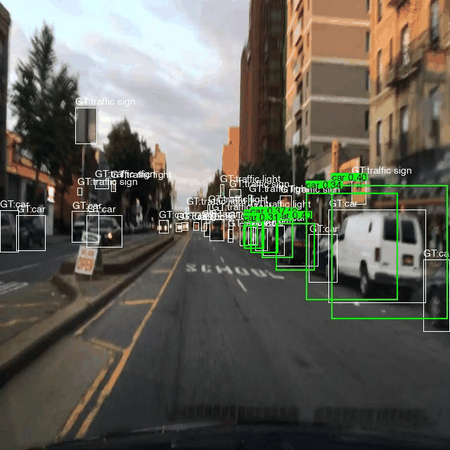
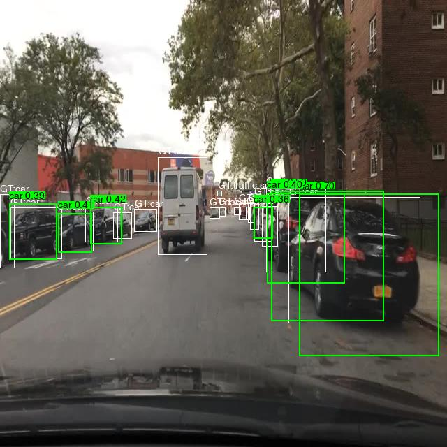
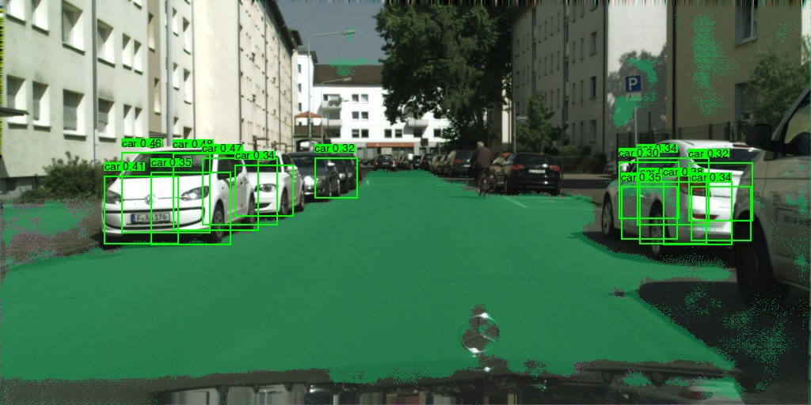
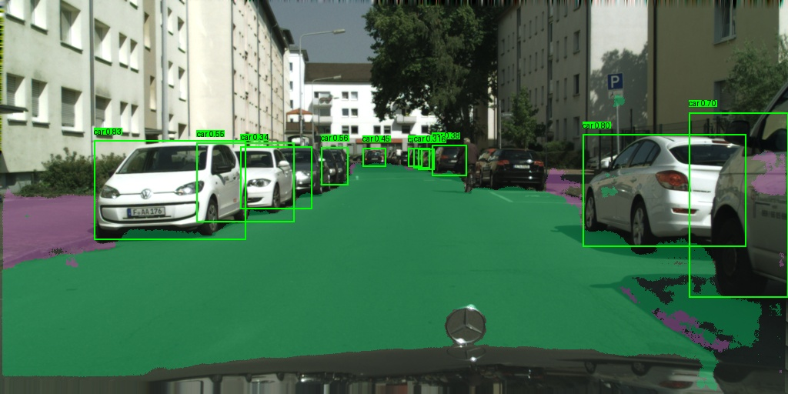
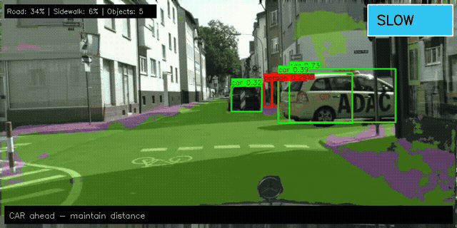
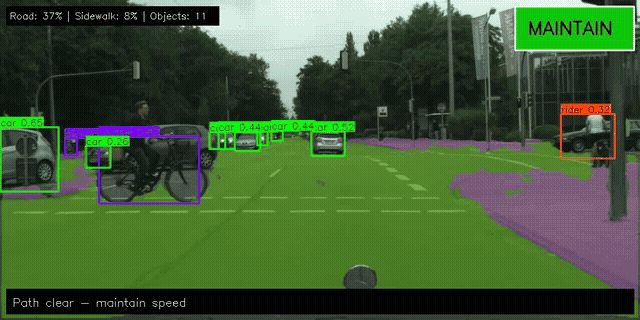
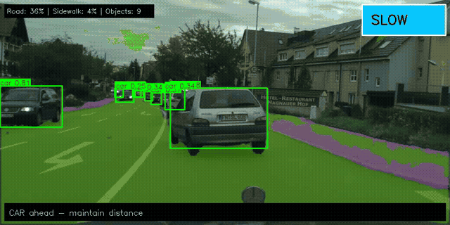

# Constellation

[](https://python.org)
[](https://pytorch.org)
[](LICENSE)
[]()
[](https://huggingface.co/spaces/cnandi/constellation)

**🚀 [Try the Live Demo](https://huggingface.co/spaces/cnandi/constellation)** — Upload any driving image and see detection + segmentation in action!

**Multi-task vision system for autonomous driving, inspired by Tesla's HydraNet architecture.**

Built with PyTorch. Trained on Cityscapes + BDD100K. Designed for real-world deployment.



*Multi-task object detection on BDD100K driving scenes — cars, traffic lights, signs, and pedestrians.*

---

## Two Surfaces (No Confusion)

- **Local React Data Engine (`/data`)**: BDD100K-focused labeling operations (ingest, review, auto-label workflows).
- **Hugging Face Demo**: Cityscapes-aligned HydraNet V2 inference showcase (detection + segmentation).

This split is intentional: the Data Engine demonstrates production data tooling, while the HF demo demonstrates model performance on the aligned training domain.

---

## Highlights

- **Multi-Task Learning** — Detection + segmentation in one forward pass (84.9% IoU on Cityscapes)
- **HydraNet-style Architecture** — Shared EfficientNet-B0 backbone with task-specific heads
- **FCOS Anchor-Free Detection** — Modern detection without anchor boxes, multi-scale (P3/P4/P5)
- **Uncertainty-Weighted Loss** — Automatic task balancing via learned parameters
- **Cloud GPU Trained** — Full training on NVIDIA H100 (RunPod) with runpodctl data transfer
- **Auto-Labeling** — YOLOv8 + MobileSAM pipeline for automated annotation

---

## Results

| Metric | Value |
|--------|-------|
| mAP@50 | 4.0% (5 epochs, 1K subset) |
| Training Loss | 2.78 → 1.45 |
| Classification Loss | 0.43 → 0.24 |
| Model Size | 8.5M parameters |

*Trained on a 1,000-image subset of BDD100K (10 object classes) to validate the architecture and training pipeline. Cloud GPU infrastructure validated on NVIDIA H100; full-scale training deprioritized to focus on multi-task expansion (Phase 4).*



---

## Phase 4: Multi-Task Learning (HydraNetV2)

**Detection + Segmentation on Cityscapes** — Full multi-task training on NVIDIA H100.



*Simultaneous object detection (bounding boxes) and drivable area segmentation (road=green, sidewalk=purple) on Cityscapes.*

### Results Comparison

| Environment | Dataset | Epochs | Seg IoU | Det Loss | Seg Loss |
|-------------|---------|--------|---------|----------|----------|
| M4 Pro (local) | 200 images | 5 | 66.5% | 1.06 | 0.58 |
| **H100 (cloud)** | **2,975 images** | **15** | **84.9%** | **0.76** | **0.20** |

### HydraNetV2 Architecture

- **Backbone:** EfficientNet-B0 (shared, frozen for 5 epochs then unfrozen)
- **Detection Head:** FCOS anchor-free (8 classes: person, rider, car, truck, bus, train, motorcycle, bicycle)
- **Segmentation Head:** 3 classes (background, road, sidewalk)
- **Multi-Task Loss:** Uncertainty-weighted (Kendall et al., 2018)
- **Parameters:** 9.14M total, 5.54M trainable

### Training Configuration

```bash
# H100 training command (15 epochs, ~20 min)
python train_multitask.py --epochs 15 --batch-size 16 --device cuda --lr 1e-4
```

### Engineering Notes

During H100 training, we encountered and fixed a CUDA device mismatch bug in `model/fcos_targets.py`:
- **Issue:** Empty bounding box lists defaulted to CPU device while model ran on CUDA
- **Fix:** Added device parameter with auto-detection from non-empty boxes in batch
- **Impact:** Training now handles images with no objects correctly on GPU

### H100 Inference Sample



*Frankfurt validation set — detection boxes + drivable area segmentation at 84.9% IoU.*

---

## Phase 5: Constellation X — Decision Engine

**Real-time driving decisions from perception outputs** — Tesla-style video processing with action overlay.

### Multi-City Demo

**Frankfurt (Urban)** — 267 frames, 24% STOP decisions


**Munster (Urban)** — 174 frames, 22% STOP decisions


**Lindau (Rural)** — 59 frames, 3% STOP decisions


*The decision engine correctly identifies scene complexity: urban scenes trigger more STOP/SLOW decisions due to pedestrians and traffic, while rural Lindau maintains speed on clear roads.*

### Results Across Cities

| City | Frames | MAINTAIN | SLOW | STOP | CAUTION |
|------|--------|----------|------|------|---------|
| Frankfurt | 267 | 32.2% | 32.2% | 23.6% | 12.0% |
| Munster | 174 | 31.0% | 35.6% | 21.8% | 11.5% |
| Lindau | 59 | 67.8% | 27.1% | 3.4% | 1.7% |

### Decision Engine Logic

| Priority | Condition | Action |
|----------|-----------|--------|
| 1 | Vulnerable road user close + in path | **STOP** |
| 2 | Vehicle close + in path | **SLOW** |
| 3 | Vulnerable road user visible | **CAUTION** |
| 4 | Low road visibility | **CAUTION** |
| 5 | Path clear | **MAINTAIN** |

### Architecture

```
┌─────────────────────────────────────────────────────────────┐
│                    Video Frame Input                         │
└─────────────────────────────┬───────────────────────────────┘
                              │
┌─────────────────────────────▼───────────────────────────────┐
│                    HydraNet V2 (9.14M params)               │
│    ┌────────────────┐   ┌────────────────────────────┐      │
│    │ Detection Head │   │   Segmentation Head        │      │
│    │ (8 classes)    │   │   (road/sidewalk/bg)       │      │
│    └───────┬────────┘   └─────────────┬──────────────┘      │
└────────────┼──────────────────────────┼─────────────────────┘
             │                          │
┌────────────▼──────────────────────────▼─────────────────────┐
│                    Decision Engine                           │
│    • Danger zone analysis (center 40% of frame)             │
│    • Close object detection (height > 15% of frame)         │
│    • Vulnerable road user priority                          │
│    • Road visibility check                                  │
└─────────────────────────────┬───────────────────────────────┘
                              │
┌─────────────────────────────▼───────────────────────────────┐
│               Annotated Video Output                         │
│    • Detection boxes with confidence                        │
│    • Segmentation overlay (road=green, sidewalk=purple)     │
│    • Action decision (top-right)                            │
│    • Reasoning text (bottom)                                │
└─────────────────────────────────────────────────────────────┘
```

### Key Files

- `decision_engine.py` — Priority-based decision logic with Detection/Decision dataclasses
- `video_processor.py` — Video pipeline with NMS, visualization, and MP4 output

---

## Architecture

```
                    ┌─────────────────────────────────────────┐
                    │           Input Image (640×640)         │
                    └─────────────────┬───────────────────────┘
                                      │
                    ┌─────────────────▼───────────────────────┐
                    │     EfficientNet-B0 Backbone (Frozen)   │
                    │         Pretrained on ImageNet          │
                    └─────────────────┬───────────────────────┘
                                      │
              ┌───────────────────────┼───────────────────────┐
              │                       │                       │
    ┌─────────▼─────────┐   ┌─────────▼─────────┐   ┌─────────▼─────────┐
    │   P3 Features     │   │   P4 Features     │   │   P5 Features     │
    │   (80×80, 40ch)   │   │   (40×40, 112ch)  │   │   (20×20, 320ch)  │
    └─────────┬─────────┘   └─────────┬─────────┘   └─────────┬─────────┘
              │                       │                       │
              └───────────────────────┼───────────────────────┘
                                      │
                    ┌─────────────────▼───────────────────────┐
                    │      FCOS Detection Head (256ch)        │
                    │  Classification + BBox + Centerness     │
                    └─────────────────────────────────────────┘
```

**Model Specs:**
- **Parameters:** 8.5M (efficient for edge deployment)
- **Backbone:** EfficientNet-B0 (ImageNet pretrained, frozen)
- **Detection:** FCOS anchor-free with focal loss
- **Classes:** 10 (person, car, truck, bus, bike, motor, rider, traffic light, traffic sign, train)

---

## Quick Start

```bash
# Clone and install
git clone https://github.com/ChandanaNandi/constellation.git
cd constellation
pip install -r requirements.txt

# Train locally (M4 Pro / CPU)
python train.py --subset 1000 --epochs 5 --batch-size 8 --device mps

# Train on GPU
python train.py --epochs 50 --batch-size 64 --device cuda --use-wandb

# Run inference
python inference.py --checkpoint checkpoints/best.pt --num-images 20
```

---

## Technical Deep Dive

### Training Pipeline
- **Classification:** Focal loss (α=0.25, γ=2.0) with proper positive sample normalization
- **Bounding Box:** GIoU loss for accurate localization
- **Centerness:** Binary cross-entropy for center-ness prediction

### FCOS Target Assignment
Multi-scale assignment based on object size:
| Scale | Stride | Object Size |
|-------|--------|-------------|
| P3 | 8 | < 32px |
| P4 | 16 | 32-64px |
| P5 | 32 | > 64px |

### Debugging Journey
- Fixed focal loss normalization bug (cls_loss was 2 orders of magnitude too low)
- Corrected FCOS size ranges for BDD100K object distribution
- Validated training with overfit test on single batch

---

## Project Structure

```
constellation/
├── model/
│   ├── hydranet_v1.py      # Single-task detection model
│   ├── hydranet_v2.py      # Multi-task detection + segmentation
│   ├── fcos_targets.py     # FCOS target assignment
│   ├── backbones/          # EfficientNet backbone
│   ├── heads/              # Detection, segmentation heads
│   └── losses/             # Multi-task uncertainty loss
├── data_engine/
│   ├── data_loader.py      # BDD100K YOLO format loader
│   ├── cityscapes_loader.py # Cityscapes multi-task loader
│   ├── augmentations.py    # Detection + segmentation augmentations
│   ├── auto_labeler.py     # YOLOv8 + MobileSAM pipeline
│   └── shadow_mode.py      # Model comparison
├── train.py                # BDD100K detection training
├── train_multitask.py      # Cityscapes multi-task training
├── inference.py            # Detection visualization
├── inference_multitask.py  # Multi-task visualization
├── decision_engine.py      # Driving decision logic (Phase 5)
├── video_processor.py      # Video pipeline with decisions (Phase 5)
└── deployment/
    ├── export_onnx.py      # ONNX export
    └── quantize.py         # INT8 quantization
```

---

## What I Learned

Building Constellation taught me:

1. **Multi-task architectures** — How shared backbones enable efficient inference across tasks (detection + segmentation in one forward pass)
2. **Uncertainty-weighted losses** — Using learnable parameters to balance task losses automatically (Kendall et al., 2018)
3. **FCOS target assignment** — The math behind anchor-free detection and why proper size ranges matter
4. **Loss debugging** — Finding normalization bugs requires systematic overfit testing
5. **Cloud GPU workflow** — RunPod H100, tmux sessions, runpodctl data transfer, W&B remote monitoring
6. **Data engineering** — Auto-labeling pipelines, Cityscapes instance mask parsing, shadow mode evaluation
7. **CUDA debugging** — Tracking down device mismatches when tensors end up on different devices
8. **Decision engines** — Priority-based reasoning systems that translate perception into action (vulnerable road user prioritization)
9. **Video pipelines** — Frame-by-frame processing with NMS, visualization overlays, and MP4 encoding

These are the skills Tesla's Autopilot team uses daily.

---

## Roadmap

- [x] Phase 1: Data engine with auto-labeling
- [x] Phase 2: HydraNet architecture with FCOS detection
- [x] Phase 3: Training pipeline with cloud GPU support
- [x] Phase 4: Multi-task learning (detection + segmentation) — **84.9% IoU on Cityscapes**
- [x] Phase 5: Constellation X — Decision engine + video pipeline
- [ ] Phase 6: Shadow mode evaluation + INT8 quantization

---

## Datasets

**BDD100K** — Berkeley Deep Drive (Phase 1-3)
- 70K training images, 10K validation
- 10 object classes for autonomous driving
- YOLO format labels

**Cityscapes** — Urban Scene Understanding (Phase 4)
- 2,975 training images, 500 validation
- 8 detection classes (person, rider, car, truck, bus, train, motorcycle, bicycle)
- 3 segmentation classes (background, road, sidewalk)
- Instance + semantic masks for multi-task learning

---

## References

- [FCOS: Fully Convolutional One-Stage Object Detection](https://arxiv.org/abs/1904.01355)
- [EfficientNet: Rethinking Model Scaling](https://arxiv.org/abs/1905.11946)
- [Multi-Task Learning Using Uncertainty to Weigh Losses](https://arxiv.org/abs/1705.07115) — Kendall et al., 2018
- [BDD100K: A Diverse Driving Dataset](https://arxiv.org/abs/1805.04687)
- [The Cityscapes Dataset](https://arxiv.org/abs/1604.01685)
- Tesla AI Day presentations on HydraNet architecture

---

## License

MIT — see [LICENSE](LICENSE)

---

**Built by Chandana Reddy** | [GitHub](https://github.com/ChandanaNandi) | Open to AI/ML opportunities
